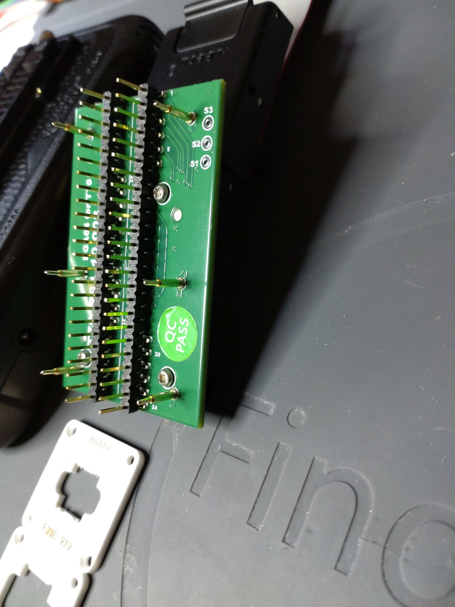
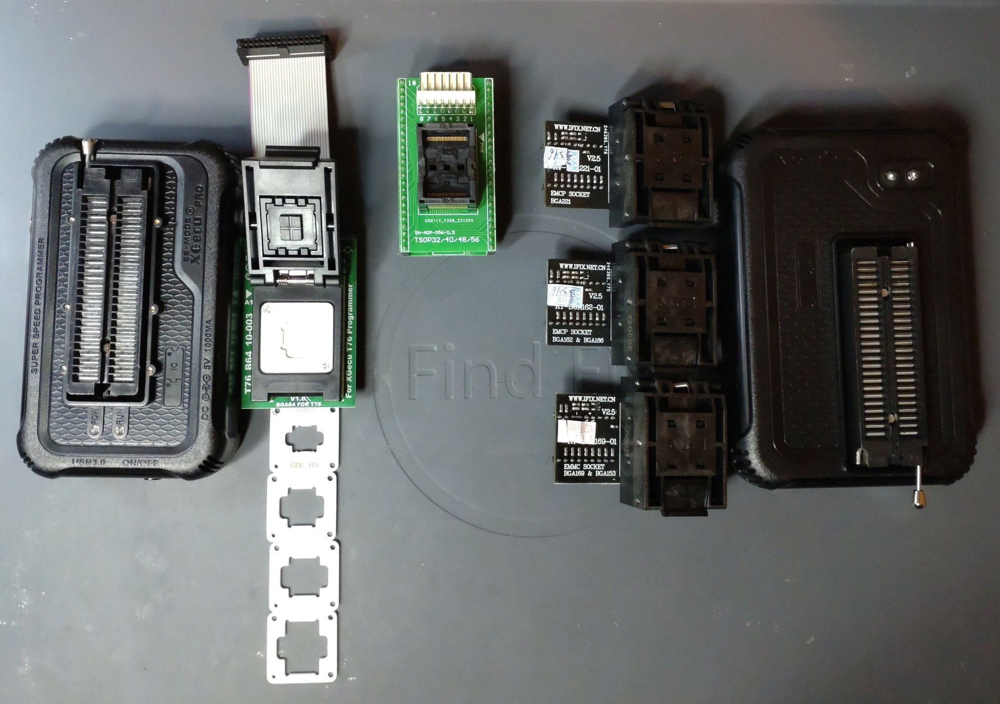
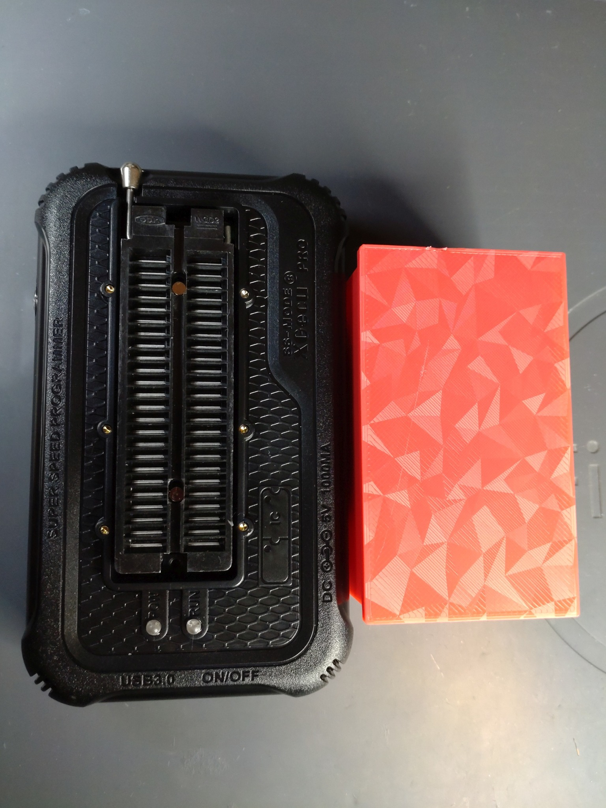
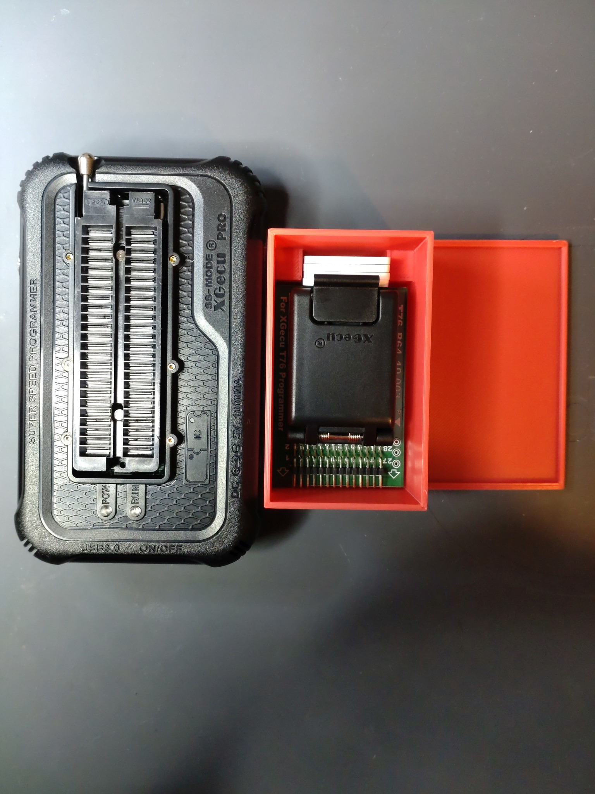
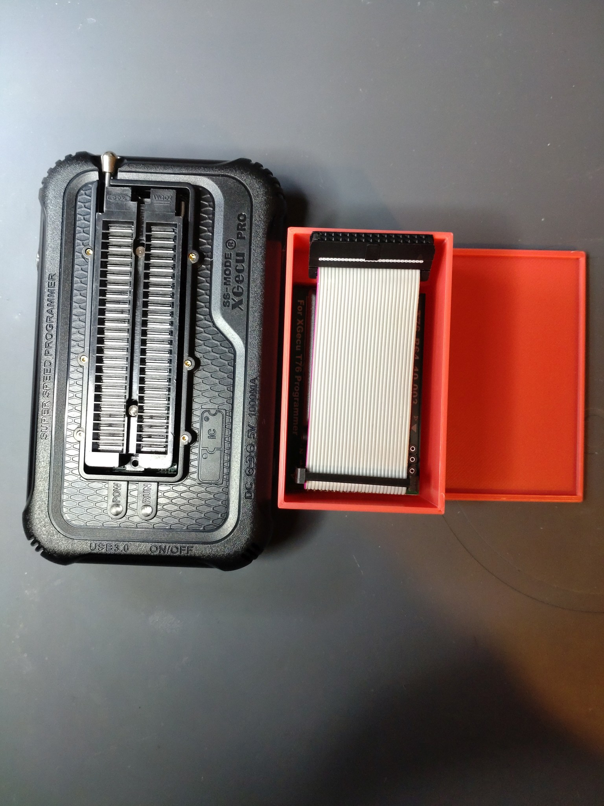

# T76_B64-enclosure
3D printable enclosure for T76 BGA64 adapter. Created with Rhino 8.

XGecu released the new T76 programmer in January 2025. There are 3 BGA adapters for the T56. 
XGecu designed the holly grail of BGA adapters for the T76 with which you only need this single adapter for all BGA types.
The adapter called T76_B64_10-003 arrived with some stencils for different sizes of BGA devices.
However, after unpacking, i noticed the six special pogo-pins on this adapter look like fragile to me.

I have designed this enclosure for the adapter with accessories for storage on the shelf.

Requirements:
* 3D printer 
* Filament of your choice (i used PETG)

## View

 

  
 

  

 
   

 
